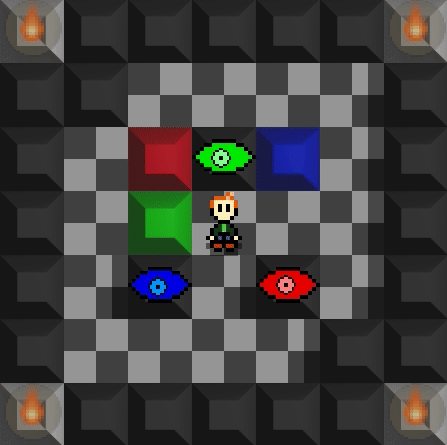

<p align="center">
  
</p>

------

An experimental Sokoban-esque puzzle game developed using Rust and SDL2. Very much a WIP. :construction_worker:

<p align="center">
  
</p>

The objective is to move the colored blocks into the line of sight of a matching eye.

## Build

Install the SDL2 dependencies for your environment.

### Ubuntu SDL2 Installation
```
$ sudo apt install libsdl2-dev libsdl2-2.0-0 -y
$ sudo apt install libjpeg9-dev libwebp-dev libtiff5-dev libsdl2-image-dev libsdl2-image-2.0-0 -y
$ sudo apt install libmikmod-dev libfishsound1-dev libsmpeg-dev liboggz2-dev libflac-dev libfluidsynth-dev libsdl2-mixer-dev libsdl2-mixer-2.0-0 -y
$ sudo apt install libfreetype6-dev libsdl2-ttf-dev libsdl2-ttf-2.0-0 -y
```

Then build and execute the game with the following:

```
$ cargo run 
```

## Credits

Music composed by [Kevin MacLeod](https://incompetech.com/music/royalty-free/index.html?isrc=USUAN1100181).
